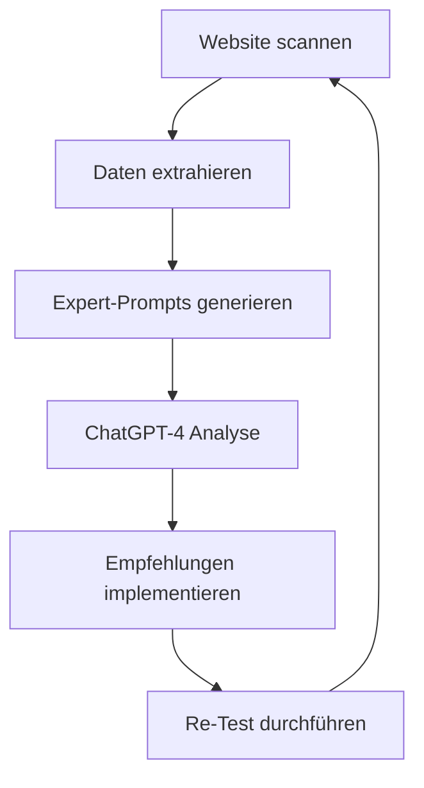

# Expert-Prompts für WCAG-Analyse

Diese Prompts werden für die automatisierte WCAG-Analyse mit ChatGPT-4 verwendet.

## Verwendung

1. Öffne den gewünschten `prompt_*.md` für den WCAG-Bereich
2. Kopiere den gesamten Inhalt
3. Füge ihn in ChatGPT-4 ein
4. Erhalte eine detaillierte Analyse

## Prompt-Struktur

Jeder Expert-Prompt enthält:

- WCAG-Kriterien und Anforderungen
- Extrahierte Website-Daten
- Analyse-Anweisungen
- JSON-Response-Format

## Verfügbare Prompts

- `prompt_1_1_textalternativen.md`
- `prompt_1_2_zeitbasierte_medien.md`
- `prompt_1_3_anpassbare_darstellung.md`
- `prompt_1_4_wahrnehmbare_unterscheidungen.md`
- `prompt_2_1_tastaturbedienung.md`
- `prompt_2_2_genuegend_zeit.md`
- `prompt_2_3_anfaelle_vermeiden.md`
- `prompt_2_4_navigation.md`
- `prompt_3_1_lesbarkeit_sprache.md`
- `prompt_3_2_vorhersehbarkeit.md`
- `prompt_3_3_eingabeunterstuetzung.md`
- `prompt_4_1_robustheit_kompatibilitaet.md`

## Generierung

Die Prompts werden automatisch durch den `prompt_generator.py` erstellt.
Dabei werden aktuelle Analysedaten aus der Website-Prüfung integriert.

## Wartung

- Regelmäßige Aktualisierung der WCAG-Kriterien
- Anpassung der Extraktions-Logik
- Optimierung der Prompt-Struktur
- Verbesserung der Analyse-Anweisungen

## Qualitätssicherung

- Einheitliches Format
- Aktuelle WCAG 2.1 Kriterien
- Optimierte Struktur für ChatGPT-4
- Validierte JSON-Schemas

# 🎯 WCAG Expert-Prompts für BarrierefreiCheck

## Übersicht
Diese Collection enthält spezialisierte ChatGPT-4 Prompts für die WCAG 2.1 Barrierefreiheitsbewertung, basierend auf extrahierten Website-Daten.

## 🔗 Verbindung zu unseren Prüfungskriterien

Unsere Expert-Prompts decken die Hauptbereiche der WCAG 2.1 Richtlinien ab:

### I. Wahrnehmbarkeit
- **[1.1 Textalternativen](prompt_1_1_textalternativen.md)** 
  - Alternativtexte für Bedienelemente
  - Alternativen für informative Grafiken
  - Layout-Grafiken Kennzeichnung
  - Multimedia-Alternativen
  - CAPTCHA-Alternativen

- **[1.2 Zeitbasierte Medien](prompt_1_2_zeitbasierte_medien.md)**
  - Audiotranskripte
  - Video-Untertitel
  - Audiodeskriptionen

- **[1.3 Anpassbare Darstellung](prompt_1_3_anpassbare_darstellung.md)**
  - HTML-Strukturelemente
  - Überschriftenhierarchie
  - Konsistente Layouts
  - Content-Reihenfolge
  - Formular-Labels

- **[1.4 Wahrnehmbare Unterscheidungen](prompt_1_4_wahrnehmbare_unterscheidungen.md)**
  - Verwendung von Farbe
  - Kontraste und Textdarstellung
  - Visuelle Präsentation

### II. Bedienbarkeit
- **[2.1 Tastaturbedienung](prompt_2_1_tastaturbedienung.md)**
  - Tastaturzugriff
  - Keine Tastaturfallen
  - Tastaturkürzel

- **[2.2 Genügend Zeit](prompt_2_2_genuegend_zeit.md)**
  - Zeitbegrenzungen anpassbar
  - Pausieren, Stoppen, Ausblenden
  - Unterbrechungen

- **[2.3 Anfälle vermeiden](prompt_2_3_anfaelle_vermeiden.md)**
  - Verzicht auf Blitzeffekte
  - Animationskontrolle
  - Bewegungsreduktion

- **[2.4 Navigierbarkeit](prompt_2_4_navigation.md)**
  - Bypass-Blöcke
  - Seiten-Titles
  - Fokus-Reihenfolge
  - Link-Zweck

### III. Verständlichkeit  
- **[3.1 Lesbarkeit & Sprache](prompt_3_1_lesbarkeit_sprache.md)**
  - Hauptsprache-Deklaration
  - Sprachwechsel-Markierung
  - Textverständlichkeit
  - Flesch-Reading-Ease

### IV. Robustheit
- **[4.1 Kompatibilität](prompt_4_1_robustheit_kompatibilitaet.md)**
  - HTML/CSS-Validität
  - Element-Eindeutigkeit
  - ARIA-Korrektheit
  - Browser-Kompatibilität

## 🚀 Verwendung

### Schritt 1: Daten extrahieren
```bash
cd backend
python run_test.py
```
Dies generiert analysierte JSON-Dateien in `analysis_results/`

### Schritt 2: Expert-Prompts generieren
```bash
cd expert_prompts
python prompt_generator.py
```
Dies erstellt vollständige Prompts mit den aktuellen Daten

### Schritt 3: ChatGPT-4 Analyse
1. Öffne den gewünschten `ready_*_expert_prompt.md`
2. Kopiere den kompletten Prompt
3. Füge ihn in ChatGPT-4 ein
4. Erhalte detaillierte, umsetzbare Empfehlungen

## 📊 Datenintegration

Jeder Expert-Prompt erhält spezifische, extrahierte Daten:

### Textalternativen (1.1)
```json
{
  "images_with_alt_text": [...],
  "images_without_alt_text": [...],
  "aria_labels": [...],
  "form_labels": [...],
  "complex_images": [...]
}
```

### Navigation (2.4)
```json
{
  "page_titles": [...],
  "link_texts": [...],
  "heading_structure": [...],
  "focus_order": [...]
}
```

### Robustheit (4.1)
```json
{
  "html_validation_errors": [...],
  "aria_violations": [...],
  "duplicate_ids": [...]
}
```

## 🎯 Prompt-Philosophie

### Datenbasiert
- **Konkrete Beispiele**: Echte URLs und Element-Referenzen
- **Quantitative Metriken**: Prozentuale Abdeckung, Fehleranzahl
- **Qualitative Bewertung**: Alt-Text-Qualität, Link-Text-Verständlichkeit

### Umsetzungsorientiert
- **Prioritäten-Matrix**: Level A/AA/Best Practice Kategorisierung
- **Code-Beispiele**: Vorher/Nachher Implementierungen
- **Business Impact**: ROI und Compliance-Vorteile

### ChatGPT-4 Optimiert
- **Strukturierte Prompts**: Klare Abschnitte und Anweisungen
- **JSON-Integration**: Maschinenlesbare Datenformate
- **Output-Templates**: Konsistente Analyse-Ergebnisse

## 🔧 Erweiterte Features

### Automatische Prompt-Generierung
Der `prompt_generator.py` bietet:
- **Daten-Mapping**: Automatische Zuordnung von JSON-Dateien zu WCAG-Bereichen
- **Template-System**: Wiederverwendbare Prompt-Strukturen
- **Versionierung**: Zeitstempel-basierte Datenauswahl

### Integration mit BarrierefreiCheck
```python
# Beispiel: Automatische Prompt-Pipeline
from expert_prompts.prompt_generator import ExpertPromptGenerator

generator = ExpertPromptGenerator()
prompts = generator.generate_all_prompts()

# Direkte ChatGPT API Integration (optional)
# ai_analysis = chatgpt_analyze(prompts["1_1_textalternativen"])
```

## 📈 Qualitätssicherung

### WCAG 2.1 Konformität
- ✅ Level A Kriterien vollständig abgedeckt
- ✅ Level AA Best Practices integriert  
- ✅ Aktuelle ARIA Authoring Practices
- ✅ BITV 2.0 und EN 301 549 kompatibel

### Testing-Integration
- **Automated Testing**: axe-core, Lighthouse Integration
- **Manual Testing**: Screen Reader Checklisten
- **Cross-Browser**: Chrome, Firefox, Safari, Edge

### Maintenance
- **Regular Updates**: WCAG-Updates werden eingepflegt
- **Community Feedback**: GitHub Issues für Verbesserungen
- **Version Control**: Semantic Versioning für Prompt-Updates

## 🎓 Best Practices

### Für Accessibility-Audits
1. **Systematisch vorgehen**: Beginne mit Level A Violations
2. **Daten nutzen**: Echte Website-Daten > theoretische Bewertungen
3. **Business Case**: Verbinde Accessibility mit ROI-Argumenten

### Für Entwickler-Teams
1. **CI/CD Integration**: Automated A11y Testing in Pipeline
2. **Component Library**: Accessible Design System entwickeln
3. **Training**: Team-Schulungen mit konkreten Beispielen

### Für Management
1. **Risk Assessment**: Legal Compliance und Brand Protection
2. **Market Access**: 15% Zielgruppen-Erweiterung durch Accessibility
3. **ROI Tracking**: SEO-Verbesserung und Conversion-Optimierung

---

## 🔄 Workflow-Integration



## 🆘 Support

**Issues & Feedback**: Nutze GitHub Issues für Verbesserungsvorschläge
**Documentation**: Siehe `/docs` für detaillierte Implementierungsanleitungen
**Community**: Join WCAG-Expert Discord für Best Practice Austausch

---
*Expert-Prompts für professionelle WCAG 2.1 Barrierefreiheitsbewertung* 